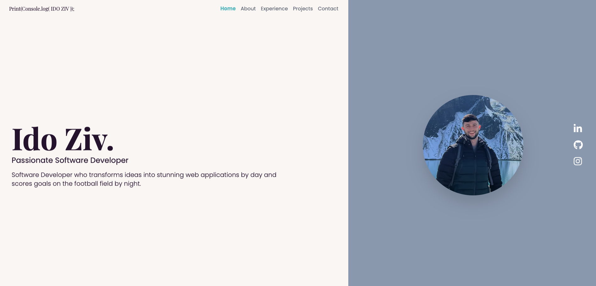

# Ido Ziv's Portfolio

## Table of Contents

- [Description](#description)
- [Technologies](#technologies)
- [Installation](#installation)
- [Contact](#contact)

## Description

Welcome to my portfolio! This website showcases my projects and skills as a software developer. Here you will find information about my key projects, professional experience, and ways to get in touch with me.

## Technologies

- **Framework**: Next.js
- **Styling**: Tailwind CSS
- **Animations**: Framer Motion
- **Deployment**: Vercel

## Installation

To get started, just clone the repository and run `npm install && npm run dev`:

git clone https://github.com/idoziv15/portfolio-website.git
npm install
npm run dev

## Contact

- **Name**: Ido Ziv
- **Email**: idoziv56@gmail.com
